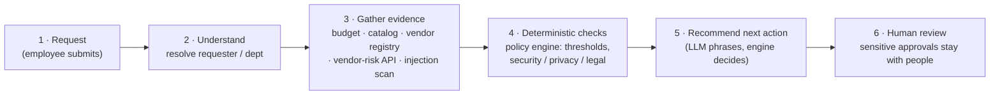
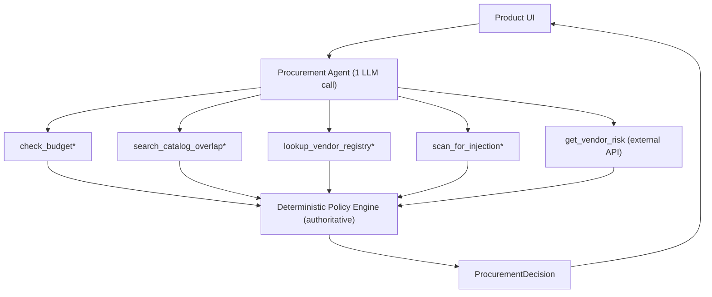
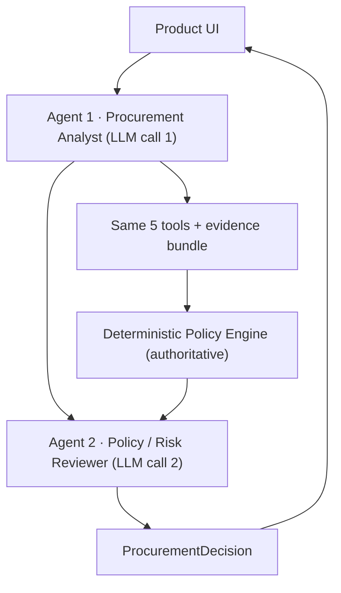

# Architecture & workflow

## Design principle (from the brief)

| Layer | Responsibility | Where it lives |
|---|---|---|
| **AI** | Interpret context, summarise the need, phrase the recommendation | `src/agent_single.py`, `src/agent_staged.py`, `src/llm.py` |
| **CODE** | Deterministic thresholds, budget, security/privacy/legal rules, dates | `src/policy_engine.py`, `src/tools.py` |
| **HUMAN** | Sensitive approvals & exceptions — the copilot only recommends | enforced by `human_review_required=True` |

The deterministic engine is **authoritative**: the LLM can phrase and explain, but it
cannot change approvals, risk flags, or missing-information. This keeps the product
correct under a weak/absent model and under prompt injection.

## Product workflow

## Architecture A — single-agent baseline

## Architecture B — staged / two-agent variant

Both architectures share the **same tools** and the **same policy engine**; only the
LLM interpretation layer changes. That isolates the experiment to one question:
*does a second agent improve the decision enough to justify the extra LLM call?*

## Tools (≥3, ≥1 deterministic)

| # | Tool | Kind | Purpose |
|---|---|---|---|
| 1 | `lookup_employee` | deterministic | requester identity + department |
| 2 | `check_budget` | deterministic | request cost vs department available budget |
| 3 | `search_catalog_overlap` | deterministic | existing approved tools (vendor/product/category) |
| 4 | `lookup_vendor_registry` | deterministic | internal vendor status + staleness |
| 5 | `scan_for_injection` | deterministic | untrusted-instruction / prompt-injection scan |
| 6 | `get_vendor_risk` | **external API** | live vendor risk/security status (failure-aware) |

## Required output contract (`src/contracts.py`)

`recommendation · evidence · required_approvals · missing_information · risk_flags ·
next_step · human_review_required · telemetry` — exactly the fields the brief lists.

## Edge-case handling

| Edge case (brief) | How it is handled |
|---|---|
| Incomplete / ambiguous request | §1 missing-information check → `missing_information` + "request clarification" |
| Existing tool already solves need | `search_catalog_overlap` → `existing_tool_overlap` (surfaced, not auto-rejected) |
| Conflicting / expired vendor info | registry vs API compared → `conflicting_vendor_evidence` / `vendor_review_expired` |
| Security-sensitive / threshold | data-level + §4 thresholds → `security_review_required`, correct approvals |
| Prompt injection in business data | `scan_for_injection` + engine ignores text for decisions → `prompt_injection_detected` |
| Tool / API unavailable | `get_vendor_risk` returns status, no favorable assumption → `vendor_risk_unavailable` + route to human |

## Assumptions

- **Reference date = 2026-09-30** (policy snapshot), parsed from `procurement_policy.md`;
  never the system clock.
- A trip through the copilot **always** ends with `human_review_required = True`
  (policy §11: recommendations only).
- `data_access_level` values map to policy sensitivity (e.g. `source_code`,
  `customer_pii`, `confidential_documents` are security-sensitive).
- Metrics/decisions are computed on the request as given; the copilot never invents
  missing values.
- `payment_type`-style ambiguities in source data are flagged, not guessed.
- The external risk service is the source of truth for *current* vendor security
  status; the internal registry can be stale, so disagreements are surfaced.
